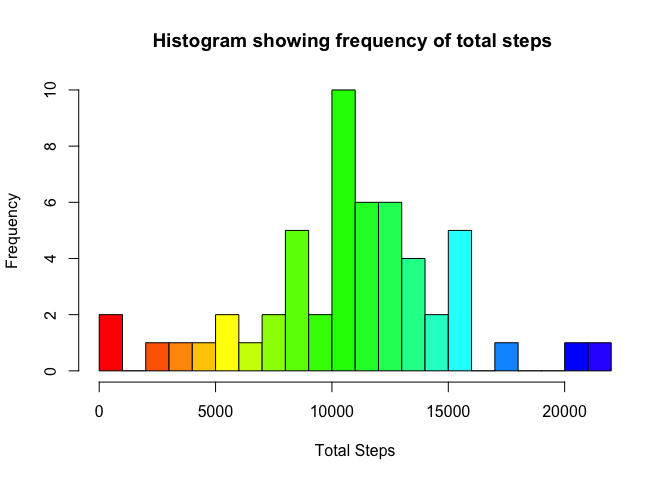
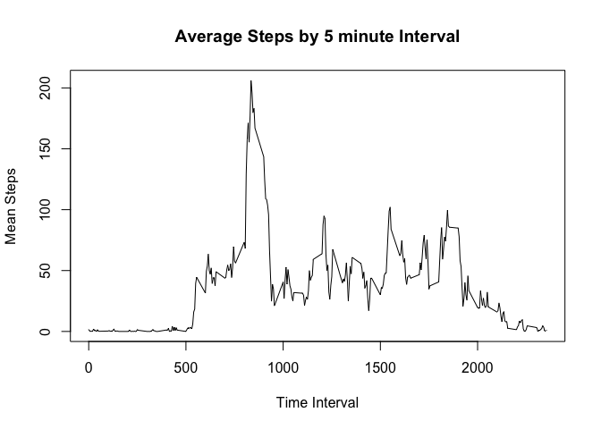
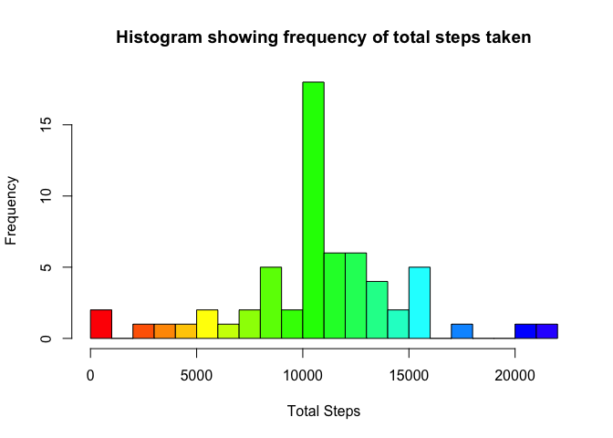
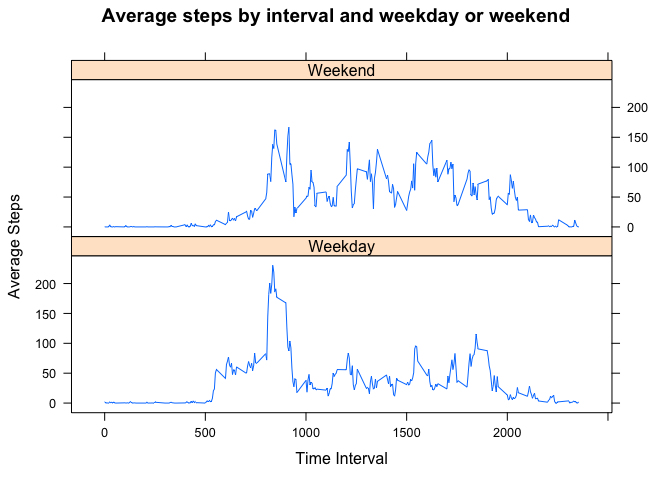

## Loading and preprocessing the data


```r
setwd("~/Documents/Projects/Coursera/5-Reproducible-Research/Project-1/RepData_PeerAssessment1")


library("lattice")

unzip("activity.zip")
datadf <- read.csv("activity.csv")
datadf$date <- as.Date(datadf$date)
datadf$interval <- formatC(datadf$interval, width = 4, format = "d", flag = "0")
```


## What is mean total number of steps taken per day?
Ignoring Empty Values  


```r
dailyStepCount <- aggregate(steps ~ date, data = datadf, sum, na.rm = TRUE)
hist(dailyStepCount$steps, breaks = 20, col = rainbow(30), main = "Histogram showing frequency of total steps ", xlab = "Total Steps", ylab = "Frequency")
```

<!-- -->

```r
meandsc <- format(mean(dailyStepCount$steps), scientific = FALSE)
mediandsc <- format(median(dailyStepCount$steps), scientific = FALSE)
```

The mean daily step count is 10766.19  
The median daily step count is 10765  

## What is the average daily activity pattern?

```r
intervalStepCount <- aggregate(steps ~ interval, data = datadf, mean, na.rm = TRUE)
plot(intervalStepCount, type = "l", main = "Average Steps by 5 minute Interval", xlab = "Time Interval", ylab = "Mean Steps")
```

<!-- -->

```r
maxisc <- format(intervalStepCount$interval[which.max(intervalStepCount$steps)], scientific = FALSE)
```

The maximum number of steps across all days was during the 0835 interval  

## Imputing missing values

```r
completedf <- datadf 

print(paste("The total number of missing rows is", sum(is.na(completedf$steps))))
```

```
## [1] "The total number of missing rows is 2304"
```

```r
# We will impute the missing values by rounding off the step count for that 5 minute interval

for (i in 1:nrow(completedf)) {
        if (is.na(completedf$steps[i])) {
                missingtime <- completedf$interval[i]
                completedf$steps[i] <- round(intervalStepCount$steps[which(intervalStepCount$interval == missingtime)])
        }
}

#print(paste("The total number of missing rows after imputation is ", sum(is.na(fulldf$steps))))

completeStepCount <- aggregate(steps ~ date, data = completedf, sum)
hist(completeStepCount$steps, breaks = 20, col = rainbow(30), main = "Histogram showing frequency of total steps taken", xlab = "Total Steps", ylab = "Frequency")
```

<!-- -->

```r
meancsc <- format(mean(completeStepCount$steps), scientific = FALSE)
mediancsc <- format(median(completeStepCount$steps), scientific = FALSE)
```

There are 8 more entries in the 10-12,000 steps now as we have added in the average value for missing days  
  
The mean complete step count is 10765.64 compared to 10766.19 with missing values  
The mediand complete step count is 10762 compared to 10765 with missing values  

There is a minor difference due to rounding but there are 2 reasons these averages have not changed...

1. Averages were calulated with NA values removed  
2. These NA were for complete dates only as can be seen by the following table 


```r
table(datadf$date[is.na(datadf$steps)])
```

```
## 
## 2012-10-01 2012-10-08 2012-11-01 2012-11-04 2012-11-09 2012-11-10 
##        288        288        288        288        288        288 
## 2012-11-14 2012-11-30 
##        288        288
```

## Are there differences in activity patterns between weekdays and weekends?


```r
# Factor in weekend and weekday to the complete data set as per assignment
completedf$day <- weekdays(completedf$date)
completedf$day[completedf$day %in% c("Saturday", "Sunday")] <- "Weekend"
completedf$day[completedf$day != "Weekend"] <- "Weekday"
completedf$day <- as.factor(completedf$day)

# Aggregate data
dayisc <- aggregate(steps ~ interval + day, data = completedf, mean)
dayisc$interval <- as.integer(dayisc$interval)

xyplot(steps ~ interval | factor(day), 
       data = dayisc, 
       layout=c(1,2), 
       type = "l", 
       xlab = "Time Interval",
       ylab = "Average Steps",
       main = "Average steps by interval and weekday or weekend"
      )
```

<!-- -->

From the chart above we can see how the average steps are much more consistent during the day on the weekend.  During the week there are peaks during usual travel times and lunch but activity drops in between indicating the subject is maybe sat down at a desk.
